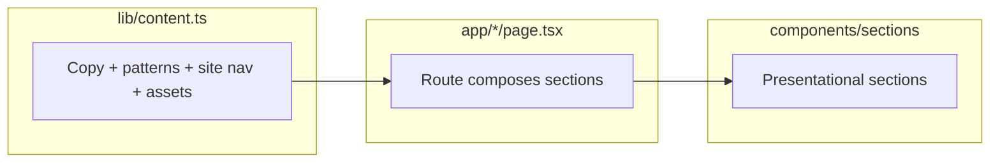

# Architecture

Overview of how this repository is structured and how requests, content, and SEO flow through the app. For adding automated tests, see [TESTING_SPEC.md](./TESTING_SPEC.md).

## Product shape

This is a **Next.js App Router** marketing site for the book *When Others Look to You*: homepage story, pattern catalog, idea page, book landing, about/resources placeholders, intro video, and newsletter signup. There is **no database** in-repo; **copy and routing constants** live in **`lib/content.ts`** (or route-local imports from there).

---

## Top-level layout

```
app/                 # Routes, layouts, global CSS, API route
components/
  layout/            # Header, Footer (shell)
  pages/             # Reusable full-page shells (e.g. SimpleMarketingPage)
  sections/          # Large vertical slices (Hero, patterns, book, etc.)
  ui/                # Small primitives + book 3D stack (BookCover, Button, …)
  icons/             # SVG social icons
lib/                 # Content, metadata helpers, fonts, cn()
public/assets/       # Static images referenced by URL
```

**Alias:** `@/` → project root (see `tsconfig.json`).

---

## Runtime model

- **React Server Components** are the default. Pages and most sections render on the server unless a file sets **`"use client"`**.
- **Client components** today include anything that needs browser-only APIs or heavy client libraries:
  - **`components/layout/Header.tsx`** — mobile drawer, body scroll lock.
  - **`components/sections/RenewalErosionSection.tsx`** — Framer Motion scroll-linked effects.
  - **`components/ui/NewsletterForm.tsx`** — `fetch` to `/api/subscribe`, React state.
- **Layouts:** `app/layout.tsx` wraps all routes with **Header**, **`<main>`**, **Footer**, **next/font** variables, and root **`metadata`** / **`metadataBase`** for canonical and OG URL resolution.

---

## Content and data flow



1. **`lib/content.ts`** exports typed objects: **`site`**, **`heroContent`**, **`patterns`**, **`patternSectionContent`**, **`sectionContent`**, page-specific blobs (`ideaPageContent`, `bookPageContent`, …), and **helpers** (`getPatternBySlug`, `getAllPatterns`, `getRelatedPatterns`, `getPatternsByCategory`, `resolveRelatedPatterns`, `getPatternsGrouped`, `formatIdeaDefinitionSentence`, …).
2. **Route files** (`app/page.tsx`, `app/patterns/page.tsx`, …) **import** those objects and **spread props** into section components. Changing copy rarely requires touching JSX beyond prop wiring.
3. **Patterns** are **`PatternCardItem[]`**: each entry has **`seo`**, **`detail`** (long body for `/patterns/[slug]`), **`relatedPatterns`** (internal links with **`linkText`**), and card fields **`title` / `description` / `href` / `slug`**.

---

## Routing map

| Path | Source | Notes |
|------|--------|--------|
| `/` | `app/page.tsx` | Hero, pattern preview, renewal/erosion, why it matters. |
| `/idea` | `app/idea/page.tsx` + `IdeaPage` | Definition block + JSON-LD (`DefinedTerm`). |
| `/patterns` | `app/patterns/page.tsx` + `PatternsPage` | Grouped grids from `getPatternsGrouped()`. |
| `/patterns/[slug]` | `app/patterns/[slug]/page.tsx` + `PatternDetailPage` | SSG via `generateStaticParams`; metadata + **CreativeWork** JSON-LD. |
| `/book` | `app/book/page.tsx` + `BookLanding` | Book3D + CTAs. |
| `/about`, `/resources`, `/intro` | Matching `app/.../page.tsx` | Mostly content-driven shells. |
| `/api/subscribe` | `app/api/subscribe/route.ts` | POST JSON `{ email }` → Beehiiv (env-gated). |

**Discovery:** `app/sitemap.ts` and `app/robots.ts` support crawlers; pattern URLs are derived from **`getAllPatterns()`** (or equivalent list).

---

## SEO and metadata

- **`lib/metadata.ts`** centralizes **`buildPageMetadata`**, **`buildHomeMetadata`**, **`buildPatternMetadata`**, and **`buildPatternJsonLd`**. It imports **`SITE_TITLE`**, **`assets`**, **`patternGroups`**, and pattern types from **`lib/content.ts`**.
- **Segment `generateMetadata()`** in each `page.tsx` delegates to these builders so **title template** (`%s | When Others Look To You` from root layout) stays consistent.
- **Pattern pages:** meta description follows **`seo.description` → `summary` → card `description`**; Open Graph can override title/description/image via **`pattern.seo.openGraph`**.
- **Structured data:** **`application/ld+json`** scripts are emitted on **`/idea`** (DefinedTerm) and **`/patterns/[slug]`** (CreativeWork), inlined in the route file (no extra client JS).

---

## API boundary

- **`POST /api/subscribe`** validates JSON, checks **`NEWSLETTER_API_KEY`** and **`NEWSLETTER_PUBLICATION_ID`**, then calls **Beehiiv**’s public subscriptions endpoint. Failures return safe JSON errors; missing env returns **503** with a clear message.

---

## UI system

- **Tailwind CSS v4** with **`@import "tailwindcss"`** in **`app/globals.css`**; design tokens live in **`@theme`** (brand colors, fonts).
- **`lib/fonts.ts`** — **`next/font/google`** (**Playfair_Display**, **Inter**) with **`display: "swap"`**.
- **`lib/cn.ts`** — **`clsx` + `tailwind-merge`** for class composition.
- **Sections** use **`components/ui/Section.tsx`** (surface variants) and **`Container.tsx`** for width constraints.
- **Images:** **`next/image`** for photos and book art; see **`next.config.ts`** `images.qualities` and related tuning.

---

## Configuration and environment

| Concern | Location |
|---------|-----------|
| Next behavior | `next.config.ts` (image qualities, `optimizePackageImports` for `framer-motion`, cache TTL, formats). |
| Public site URL | `NEXT_PUBLIC_SITE_URL` — canonical/OG/sitemap/JSON-LD absolute URLs. |
| Newsletter | `NEWSLETTER_API_KEY`, `NEWSLETTER_PUBLICATION_ID`. |

---

## Dependencies (conceptual)

- **Next.js** — framework, App Router, metadata, Image.
- **React 19** — UI.
- **Framer Motion** — Renewal/Erosion section only (client bundle; tree-shaking aided by config).

---

## Extension points

- **New marketing page:** add route under **`app/`**, import or add content in **`lib/content.ts`**, compose **`components/sections/*`** or **`SimpleMarketingPage`**.
- **New pattern:** append **`PatternCardItem`** in **`patterns`** with **`seo`**, **`detail`**, **`relatedPatterns`** (≥2 slugs with **`linkText`**); static params and sitemap pick it up automatically.
- **CMS later:** replace **`lib/content.ts`** with fetches or a CMS SDK; keep the same **typed shapes** exported for minimal component churn.

---

## Related docs

- [TESTING_SPEC.md](./TESTING_SPEC.md) — planned automated test layers.
